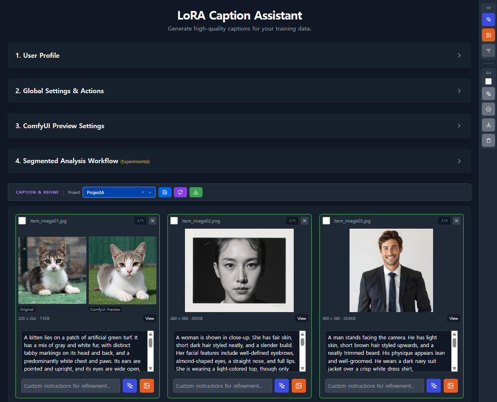

# LoRA Caption Assistant



# Description
LoRA Caption Assistant is a comprehensive tool for managing image and video datasets. It automates caption generation using Vision Language Models (VLM), ensures no work is lost through robust history management, and integrates ComfyUI to visually verify captions by generating images from them.

# Features
-   **Dataset & History Management**:
    -   **Strict Versioning**: Every change—metadata updates, file replacements—is tracked. Revert to any previous state with confidence.
    -   **Preserved Integrity**: Original files are always safe, while you freely experiment with captions and previews.
    -   **Intuitive Organization**: Drag, drop, and rename files naturally, just like on your desktop.

-   **Caption Verification**:
    -   **Visual Validation**: Verify the accuracy of your captions by generating images directly within the project using ComfyUI.
    -   **Real-time Preview**: See your generated results instantly synced to your project items.
    -   **Workflow Library**: Build and manage your own library of reusable generation templates.

-   **Automated VLM Captioning**:
    -   **Multi-Model Intelligence**: Leverage Google Gemini or local Vision Language Models (VLMs) to generate detailed, context-aware captions for both images and videos.

# Requirements        
-   **Docker & Docker Compose**: For containerized deployment.
-   **Development**:
    -   Node.js v18+ (Frontend)
    -   Python 3.10+ (Backend)

# Installation & Quick Start

First, **clone the repository**:
```bash
git clone https://github.com/zxtopower-tech/LoRA-Caption-Assistant.git
cd LoRA-Caption-Assistant
```

### 🪟 Windows
1. Double-click `run.bat`
2. Wait for the launcher to install dependencies and start servers.
- **Access**: `http://localhost:7788` (Automatically opens)

### 🐧 Linux / macOS
1. Open terminal and run:
   ```bash
   ./run.sh
   ```
- **Access**: `http://localhost:7788` (Automatically opens)

### 🐳 Docker Compose (Recommended)
```bash
docker-compose up -d
```
- **Access**: `http://localhost:7788`

# Usage
-   **Web Interface**:
    -   Navigate to the URL provided by your chosen launch method.
    -   Create a project and start uploading media.
-   **Local Development**:
    -   **Backend**: `uvicorn app:app --reload --port 8001` (in `backend/` directory).
    -   **Frontend**: `npm run dev` (in `frontend/` directory).

# Configuration
-   **Docker Volumes**:
    -   `loracaptioner-backend`: Persists `/app/backend` containing:
        -   `data/projects`: Project media and metadata.
        -   `data/workflows`: ComfyUI workflows.
        -   `data/profiles`: User settings.

# License
MIT

# Reference
- [Original Documentation](assets/README.original.md)
